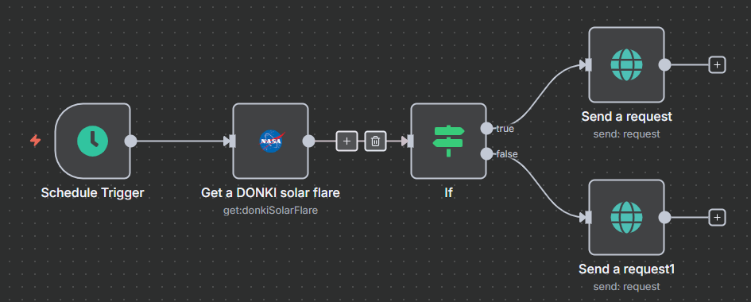

# 🌞 NASA Solar Flare Monitoring with n8n

This project contains an automated solar flare monitoring system built using n8n. It leverages NASA's DONKI (Database of Notifications, Knowledge, Information) API to track solar flare activity and send real-time notifications when significant events occur.

## 🚀 Features

- **Automated Monitoring**: Scheduled execution every day at 8:45 PM (Asia/Karachi timezone)
- **NASA API Integration**: Fetches real-time solar flare data from DONKI database
- **Intelligent Filtering**: Automatically detects M-class solar flares (significant events)
- **Real-time Notifications**: Sends instant alerts via PostBin when solar flares are detected
- **Classification System**: Processes solar flare class types for severity assessment
- **Conditional Logic**: Smart routing based on solar flare characteristics

## 🛠 Workflow Overview

The workflow consists of five main nodes that work together to monitor and alert on solar flare activity:

1. **Schedule Trigger** – Runs daily at 20:45 (8:45 PM) automatically
2. **Get a DONKI Solar Flare** – Retrieves latest solar flare data from NASA API
3. **If Condition** – Checks if solar flare catalog contains "M" class events
4. **Send a Request** (True Path) – Notifies when M-class flares are detected
5. **Send a Request1** (False Path) – Handles non-M-class solar flare events

## 📂 Repository Structure

```
├── NASA Solar Flare.json       # Exported n8n workflow
├── README.md                    # Project documentation
```

## 🔧 Setup Instructions

1. **Clone this repository:**
   ```bash
   git clone https://github.com/your-username/nasa-solar-flare-monitor.git
   cd nasa-solar-flare-monitor
   ```

2. **Configure NASA API credentials** in your n8n instance:
   - Obtain API key from [NASA Open Data Portal](https://api.nasa.gov/)
   - Create NASA API credentials in n8n
   - Name the credential "NASA account"

3. **Set up PostBin endpoint:**
   - Create a PostBin at [PostBin.org](https://postb.in/)
   - Update the `binId` in both notification nodes

4. **Import the workflow** (`NASA Solar Flare.json`) into your n8n instance.

5. **Activate the workflow** and start monitoring solar activity! ☀️

## 📸 Workflow Preview



## 🌟 Solar Flare Classification

The system monitors different classes of solar flares:

- **M-Class Flares**: Medium-intensity flares that can cause brief radio blackouts
- **X-Class Flares**: Most intense flares causing widespread radio blackouts
- **C-Class Flares**: Small flares with minimal impact on Earth
- **B-Class Flares**: Very weak flares barely detectable

## 🏗️ Architecture Diagram

```
    A[Schedule Trigger] --> B[Get DONKI Solar Flare]
    B --> C{If M-Class?}
    C -->|Yes| D[Alert: M-Class Detected]
    C -->|No| E[Log: Other Class Flare]
```

## 💡 How It Works

The monitoring system operates through this process:

1. **Daily Trigger**: Automatically executes at 8:45 PM (Asia/Karachi time)
2. **Data Retrieval**: Fetches latest solar flare data from NASA DONKI API
3. **Classification Check**: Analyzes if the catalog contains M-class solar flares
4. **Conditional Routing**: 
   - **M-Class Detected**: Sends high-priority notification with class type
   - **Other Classes**: Logs event with standard notification
5. **Alert Delivery**: Dispatches real-time notifications via PostBin webhook

## 🌍 Real-World Applications

- **Space Weather Monitoring**: Track conditions affecting satellites and astronauts
- **Communication Systems**: Prepare for potential radio interference
- **Power Grid Management**: Anticipate geomagnetic storm impacts
- **Aviation Safety**: Monitor radiation exposure for polar flight routes
- **Research & Education**: Study solar activity patterns and trends

## 📊 Data Processing

The workflow processes solar flare data including:

- **Event Timestamp**: When the solar flare occurred
- **Classification**: Flare intensity class (B, C, M, X)
- **Catalog Information**: Detailed event characteristics
- **Peak Intensity**: Maximum energy output measurements
- **Duration**: How long the solar flare lasted

## 🔍 Monitoring Capabilities

- **Real-time Detection**: Immediate alerts for significant solar events
- **Automated Scheduling**: No manual intervention required
- **Severity Assessment**: Intelligent classification of flare importance
- **Reliable Notifications**: Dual-path alerting system for redundancy
- **Historical Tracking**: Maintains execution logs for trend analysis

## 🚨 Alert System

The notification system provides:

- **Immediate Alerts**: Real-time notifications for M-class solar flares
- **Event Details**: Includes solar flare classification in messages
- **Webhook Integration**: Compatible with various notification services
- **Redundant Paths**: Multiple notification routes for reliability

## 🔬 Space Weather Impact

Understanding solar flare classifications:

- **M1-M9**: Can cause brief radio blackouts at polar regions
- **X1-X20+**: Major events affecting global communications
- **Geomagnetic Effects**: Potential aurora activity and satellite disruption
- **Radiation Storms**: Increased cosmic ray exposure risk

## 🙌 Acknowledgments

Special thanks to:

- **NASA** for providing the DONKI solar flare database and API
- **n8n** for the powerful no-code automation platform
- **Space Weather Community** for advancing our understanding of solar activity
- **NOAA Space Weather Prediction Center** for space weather monitoring standards

---

*Stay informed about space weather events that could impact our technology-dependent world! 🛰️*
